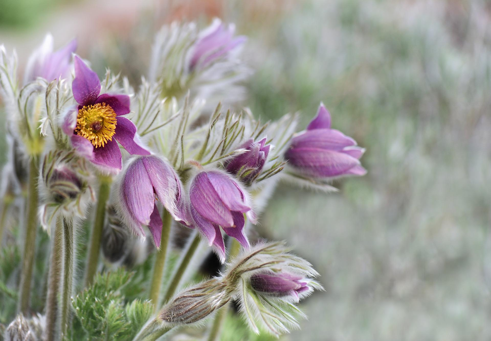
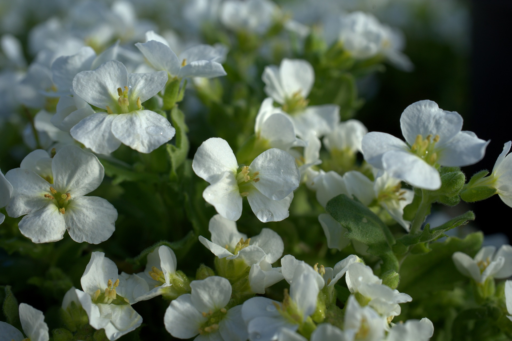
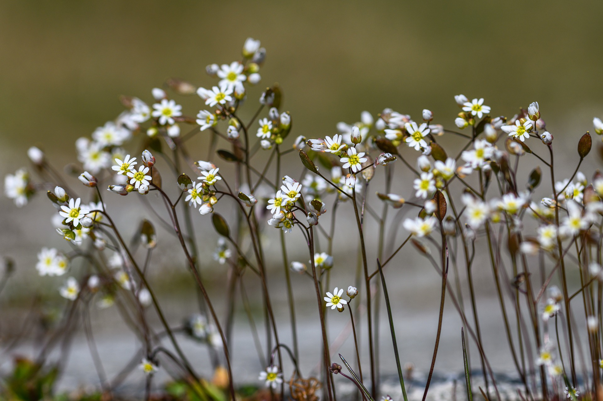
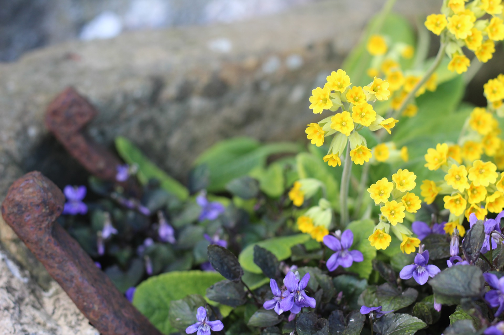
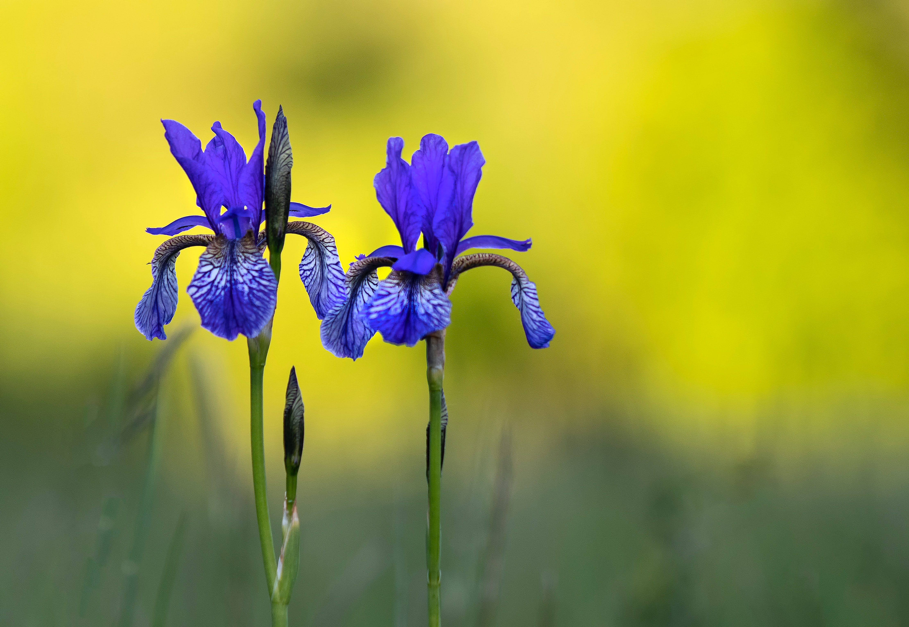

Title: How to grow alpines and which to choose
Date: 2022-06-05 17:34
Modified: 2022-06-05 17:34
Category: gardening
Tags: gardening
Slug: alpines-1
Authors: Will Frank
Summary: Learn how to bring these mountain dwellers into your garden.
Image: ./images/alpine-plants.jpg

Alpines are plants that grow naturally in an alpine climate, which occurs at
high elevation above the tree line in the mountain regions or alpine tundra.

Alpine plants have a range of adaptations that allow them to survive in the
environmental extremes of the exposed habitats of the alpine zone.

Many alpines are small perennials with a low, compact form. This minimises water
loss from evaporation and also provides protection from the crushing weight of
winter snows and the strong winds of spring and summer. The layer of air close
to the ground is also warmer and better supports plant growth.

Due to the short growing season (as little as six weeks) in the alpine zone,
many alpines are evergreen. This is because they can't afford to produce new
leaves every year in such a short space of time.

Some alpines have high sugar concentrations in the protoplasm of their leaf 
cells. This acts as a natural anti-freeze, lowing the freezing point, to allow
the plants to survive freezing conditions.

Here are some my favourite alpines to bring these fascinating plants down from
the mountains and into your garden:

## _Pulsatilla vulgaris_ (Pasque Flower)

A native of Britain's chalk downlands with a beautiful violet flower in its
natural form.

## _Arabis caucasica ‘Lotti White’_

A herbaceous plant with delicate, long lasting, white flowers in spring.

## _Saxifraga_

A common go-to for alpine gardens, these mat-forming perennials come in a
diverse range of colours.

## _Primula_

A large genus of predominantly mountain dwelling species, Primulas give a huge
range of choice to the alpine gardener.

## Alpine Bulbs

There are many bulbs and corms that are at home in an alpine garden. These
include _Galanthus_, _Iris reticulata_, _Crocus_, and dwarf _Narcissus_.

