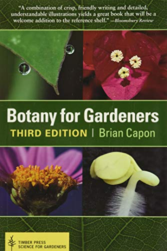
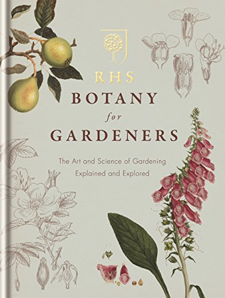
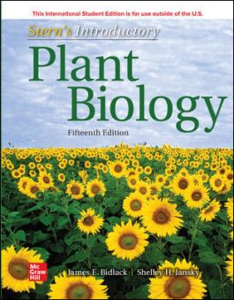
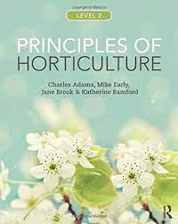

Title: The best botany books for gardeners
Date: 2022-05-15 08:59
Modified: 2022-05-15 08:59
Category: gardening
Tags: gardening
Slug: botany-books-1
Authors: Will Frank
Summary: My top reads for discovering the scientific wonders of the garden!
Image: ./images/books.jpg

## Science and the Garden: The Scientific Basis of Horticultural Practice
by David S. Ingram, Daphne Vince–Prue, Peter J. Gregory, Wiley Blackwell

## Botany: An Introduction to Plant Biology
by James D. Mauseth, Jones and Bartlett Publishers

## Botany for Gardeners
by Brian Capon, Timber Press

## RHS Botany for Gardeners: The Art and Science of Gardening Explained & Explored
by Mitchell Beazley, Royal Horticultural Society (RHS)

## Stern's Introductory Plant Biology
by James Bidlack, Shelley Jansky, Kingsley R. Stern, McGraw Hill

## Principles of Horticulture
by Charles Adams, Mike Early, Jane Brook and Katherine Bamford

## The Cabaret of Plants: Forty Thousand Years of Plant Life and the Human Imagination
by Richard Mabey, Profile Books

