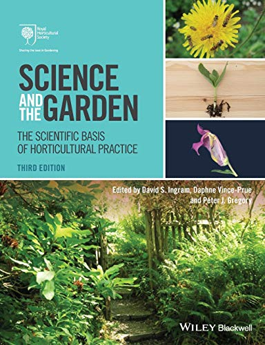
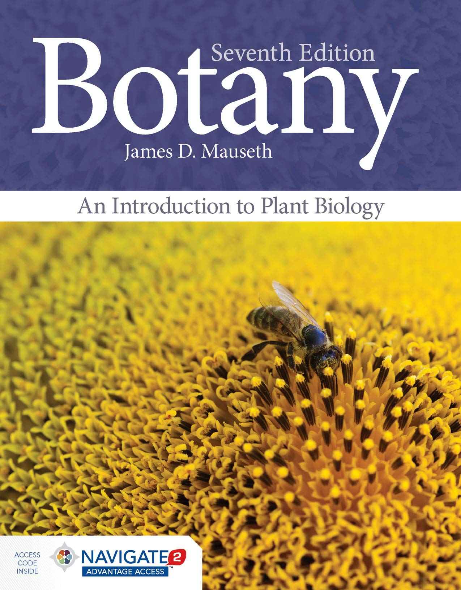
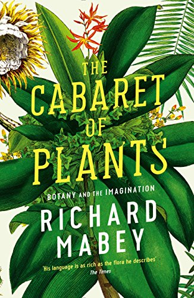

Title: The best gardening books
Date: 2022-05-05 08:59
Modified: 2022-05-05 08:59
Category: gardening
Tags: gardening
Slug: favourite-books-1
Authors: Will Frank
Summary: My top reads for a spot of armchair gardening...
Image: ./images/books.jpg

## Science and the Garden: The Scientific Basis of Horticultural Practice
by David S. Ingram, Daphne Vince–Prue, Peter J. Gregory, Wiley Blackwell

## Botany: An Introduction to Plant Biology
by James D. Mauseth, Jones and Bartlett Publishers

## The Cabaret of Plants: Forty Thousand Years of Plant Life and the Human Imagination
by Richard Mabey, Profile Books

