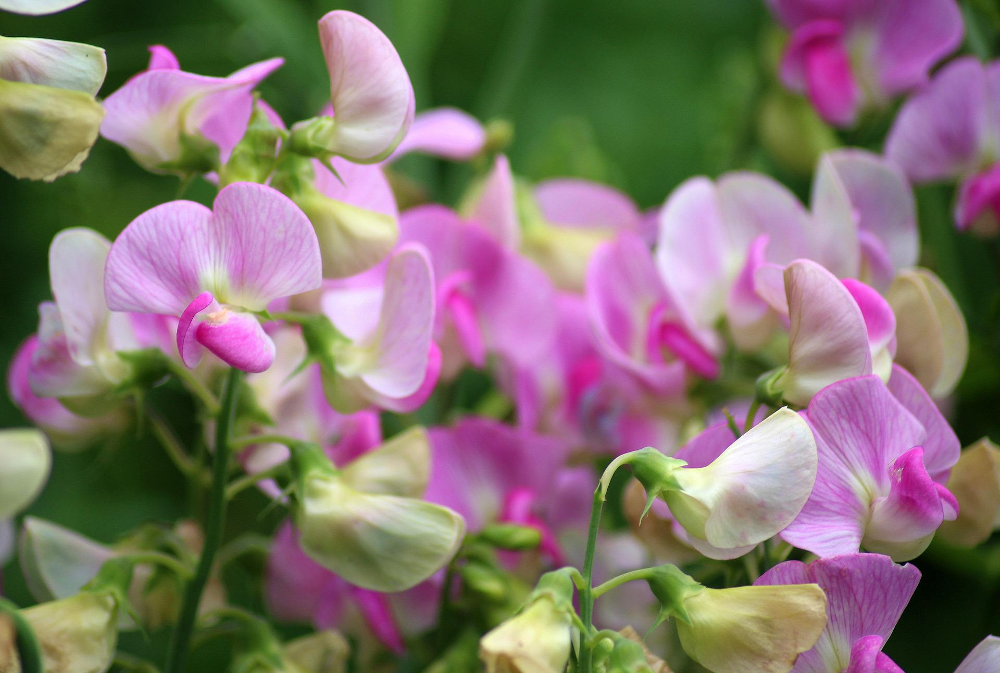
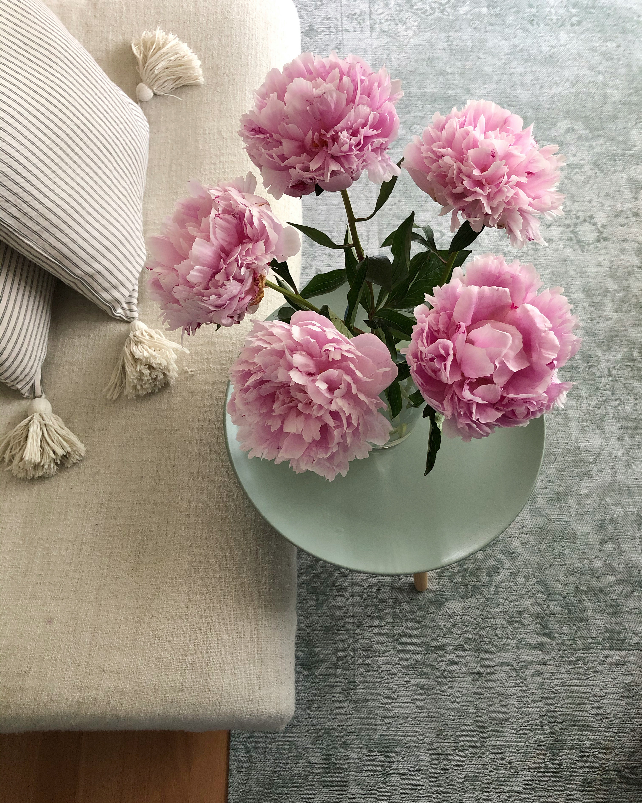
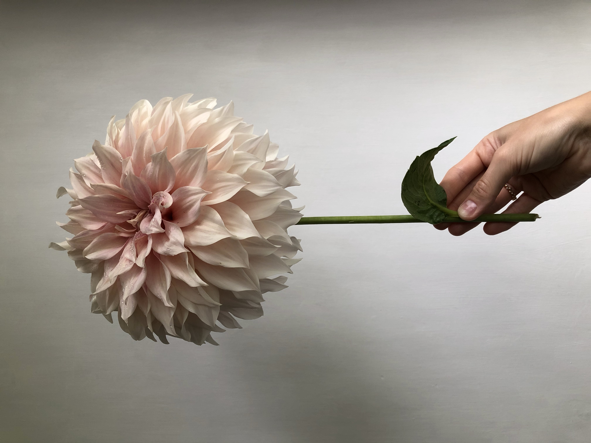
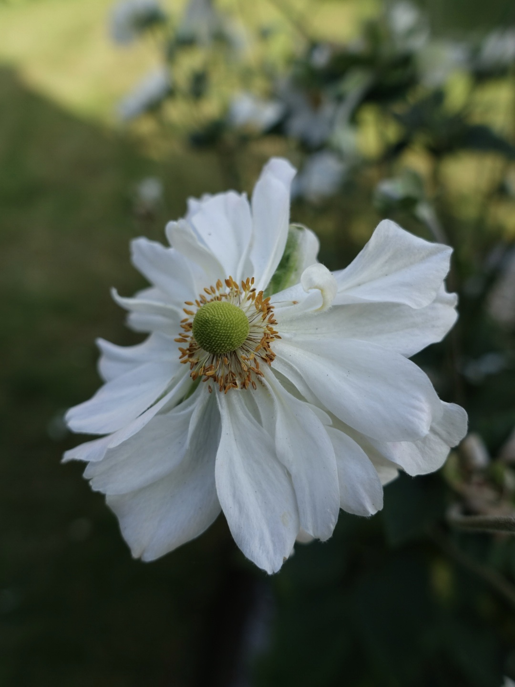
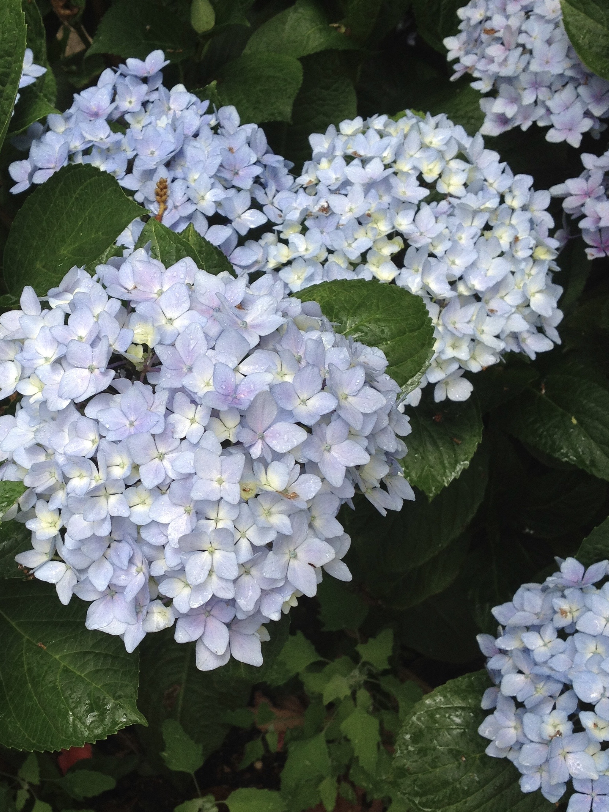
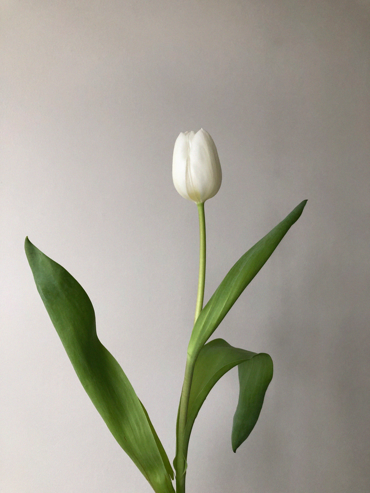

Title: Flowers to grow in a cutting garden
Date: 2022-05-29 20:33
Modified: 2022-05-29 20:33
Category: gardening
Tags: gardening
Slug: cut-flowers-1
Authors: Will Frank
Summary: Discover a cheap, diverse, and sustainable alternative to the florists.
Image: ./images/cut-flowers/cut-flower.jpg

Creating a cutting garden is a fantastic way to bring a slice of the outdoors
in. Sowing flowers from seed or growing from cuttings can be a cheap and diverse
alternative to the florists. Growing your own flowers at home also cuts down on
transport miles so is kinder to the planet.

Flowers can be grown in dedicated beds or in amongst the vegetable garden as in
a potager garden style.

## _Lathyrus odoratus_ (Sweet Peas)

With their long stems and fragrent flowers, sweet peas are a very popular cut
flower. Regular cutting is essential to keep them productive.

## _Paeonia_ (Peonies)

Peonies come in many forms and so there is bound to be one that takes your fancy.
The herbaceous varieties are particularly suited to cut flowers. Choose one
with a long stem and large flower.

## _Dahlia_

Dahlias are one of the best flowers to grow for use as cut flowers. They
have a long vase life, and provide blooms throughout the season, from mid summer
right through to the first frosts in autumn. There’s a huge range of different
types to choose from with flowers in various forms and a spectrum of colours.

## _Anemones_

Anemones are an easy to grow option for a cut flower garden. My particular
favourite are Japanese anemones (_Anemone hupehensis_) with upright stems in
varying shades of pink, purple or white.

## _Hydrangea_

A bunch of freshly cut hydrangeas makes a stunning display. The stems can be 
placed in boiling water and left for 24 hours to prolong the blooms.

## Spring Bulbs

Spring bulbs make excellent cut flowers. _Narcissus_, _Tulipa_, and _Allium_ are
all perfect for a seasonal spring display.

