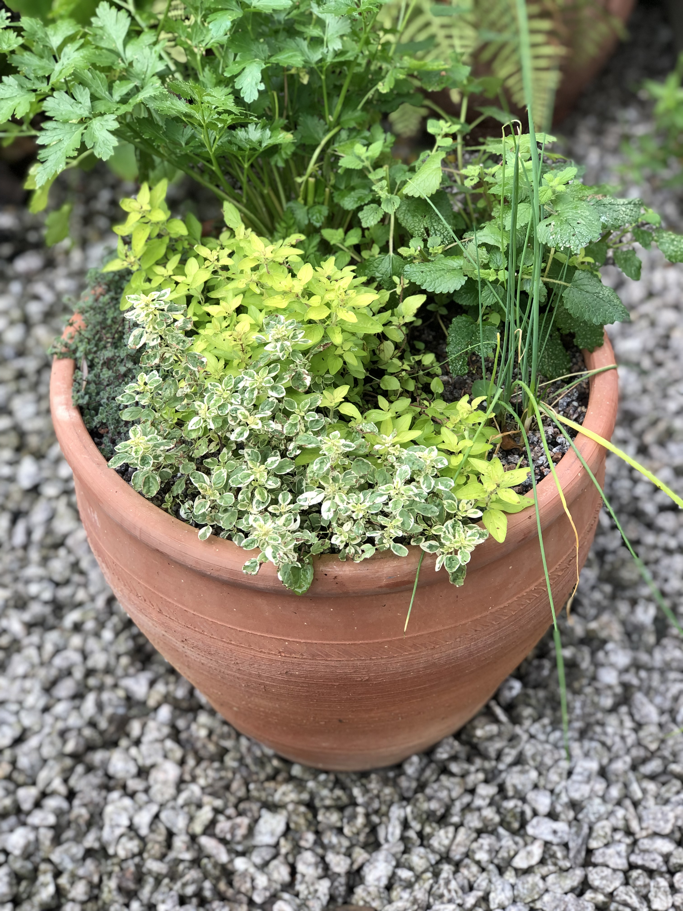

Title: How to plant a herb garden in a container
Date: 2022-05-06 06:02
Modified: 2022-05-06 06:02
Category: gardening
Tags: gardening, kitchen
Slug: herb-pot-1
Authors: Will Frank
Summary: A guide to growing your own Mediterranean herb garden in a small space.
Image: ./images/herb-pot/herb-pot.jpg

Growing your own herbs gives you great freshness, flavour and choice. Having your own herbs near the back door is a wonderful way to start growing (and eating) your own produce, creating a connection between kitchen and garden.

Herbs are very forgiving plants to grow and a herb garden can be beautiful as well as useful.

Terracotta pots suit Mediterranean herbs such as rosemary, thyme, and sage since
terracotta is porous and these herbs prefer very well drained (and rather poor) soil.

First place some broken terracotta pieces (crocks) covering the hole at the bottom of the pot. This will
prevent compost from falling out, and improve drainage.

Next fill the pot with a peat free compost mixed (roughly) 50:50 with horticultural grit
or sharpsand. If water does not flow almost immediately through the pot then the drainage is
not good enough - we're using mediterranean herbs and so good drainage is crucial!

Herbs from different regions may prefer different conditions. Basil for example, would
need a really rich, moisture-retentive mix instead.

Now you can get planting!

Fill in any gaps with more compost and top dress with a layer of grit.

Fast forward 8 weeks - and et voila!

It's always good to leave lots of space around each herb - they will fill out quickly.

These herbs will need to be kept in a sunny spot  (preferably near the kitchen!) and watered regularly.

The herbs in my pot are:

* Marjoram (_Origanum vulgare 'Aureum'_)
* Parsley (_Petroselinum crispum 'French'_)
* Oregano (_Origanum vulgare 'Country Cream'_)
* Wild Thyme (_Thymus woolly_)
* Lemon balm (_Melissa officinalis_)
* Chives (_Allium schoenoprasum_)