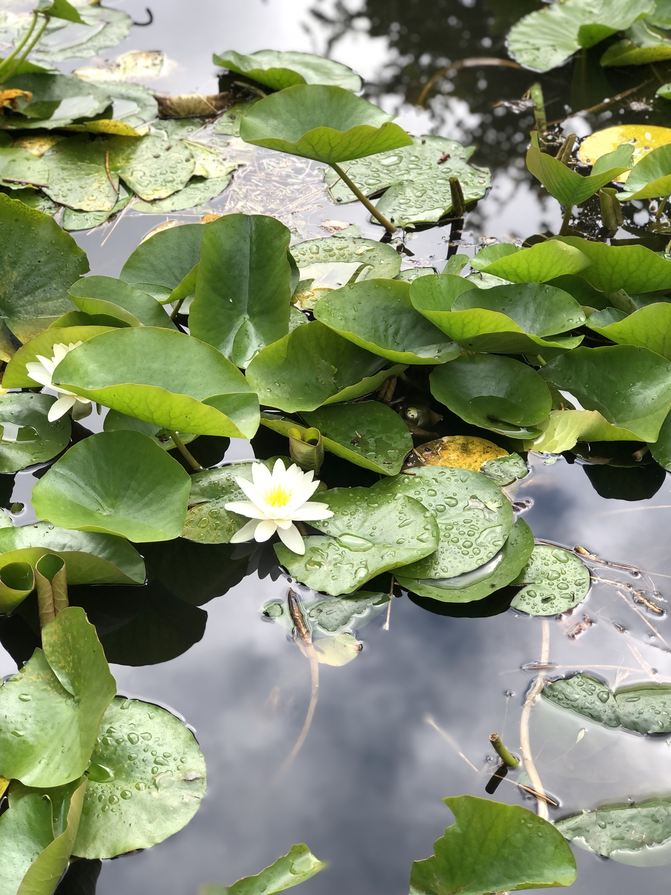
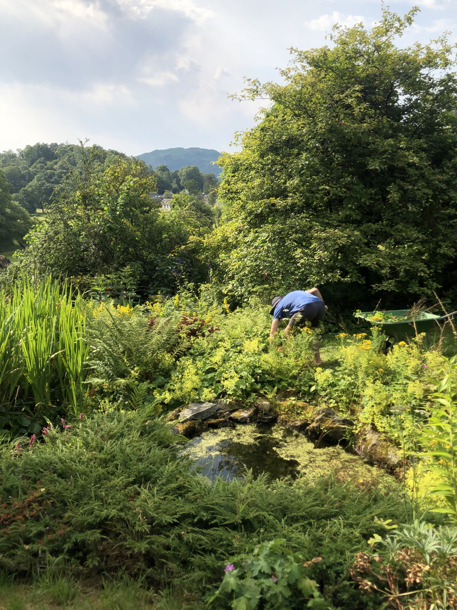
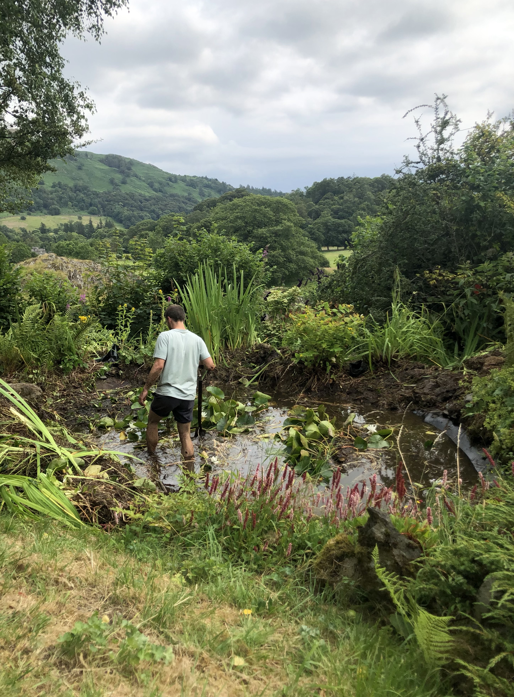
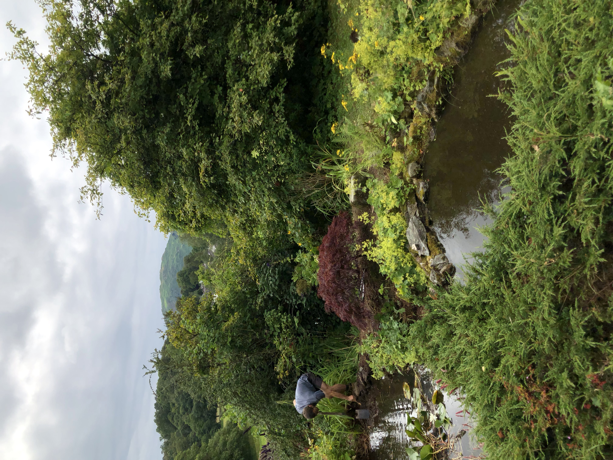
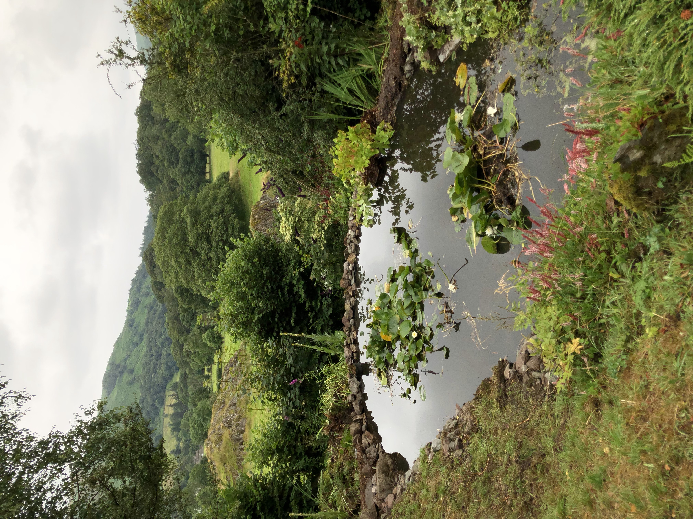

Title: Journal

# Pond Restoration

We were recently involved in the restoration of a large ornamental pond in a 
Grasmere garden in the heart of The Lake District national park. The ponds are
situated at the bottom of the gardens, borrowing fantastic views of the
surrounding landscape, with Rydal Fell in the distance. Following a period of
neglect, the ponds had been swamped by yellow flag iris (_Iris pseudacorus_),
lady's mantle (_Alchemilla mollis_), brambles (_Rubus fruticosus_), and
ground elder (_Aegopodium podagraria_).

Careful not to damage the liner (or the water pump and cables), we hacked our
way through the thick mass of intertwined iris rhizomes, thinning the
_Alchemilla mollis_, and clearing as we went. We removed the large ferns as they
had become out of proportion and also cut back the water lily (_Nymphaea alba_)
to a more managable size. In the process we uncovered a dwarf _acer palmatum_ 
which was a pleasnt surprise and adds an oriental touch the design.

Following this, any remaining debris on the surface was cleared by hand with a
rake. We left all the removed material by the side of the pond over night to
allow time for any beasties to make their way safely back into the ponds before 
composting.

The prostrate conifer was cutback from around the top pond and the stones were
naturally re-arranged around the bottom pond to redefine the edges to their
original shape.

The pump for the water fall needed a good clean and to finish off we topped up
the ponds with a hose.

