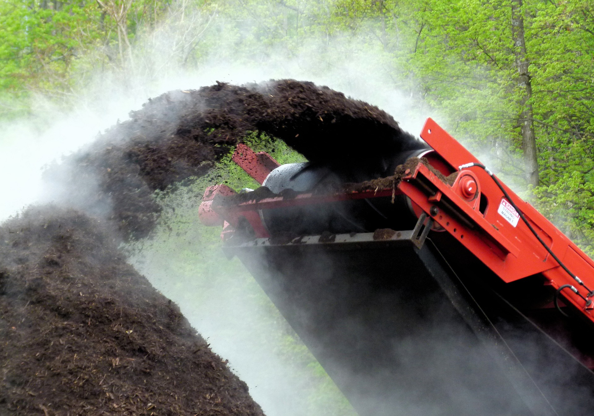

Title: 9 eco-friendly and sustainable alternatives to peat compost
Date: 2021-09-12 08:22
Modified: 2021-09-12 08:22
Category: gardening
Tags: gardening, conservation
Slug: peat-alternatives-1
Authors: Will Frank
Summary: The best eco-friendly and sustainable alternatives to using peat compost in the garden.
Image: ./images/peat-bog.jpg

Until recently peat has been a main component of many garden composts. Peat is
formed of partially decomposed vegetation with the type formed from sphagnum
moss being particually prized in horticulture due to its open structure and
water retaining properties. Peat bogs and fens form a unique wetland ecosystem
which takes many thousands of years to form and provides habitat for a diverse
range of plants, insects and birds. Peatland is also the earth's largest carbon
store (storing 42% of all soil carbon) and harvesting it releases this carbon
dioxide back into the atmosphere.

Due to its impact on the environment, sales of peat-based composts are due to be
banned in the UK by 2024.

Here are 9 sustainable alternatives to peat you can use in your garden to help
preserve this precious habitat and cut your carbon footprint.

## 1. Farmyard Manure

A traditional material used to maintain and improve soil fertility and
structure. It consists of straw or other bedding material, mixed with well
rotted animal faeces and urine. A full range of nutrients is released into the
soil. 

## 2. Garden (home) Compost

Making your own compost has a host of benefits including; recycling garden and
kitchen waste without needing transport.

## 3. Composted Municipal Waste

Essentially the same as garden compost, but as it normally composts at a much
higher temperature weeds and diseases have been killed off. It can, however, 
have issues with plastic and glass contamination.

## 4. Spent Mushroom Compost

A by-product of the mushroom industry. It is typically straw capped with chalk,
which gives a characteristically high pH. This makes it useful for increasing
soil pH as an alternative to liming but it must not be used for acid loving
plants (ericaceous).

## 5. Leaf Mould

Leaf mould is made from well rotted leaves of decidous trees and makes a highly
prized low nutrient compost. 

## 6. Pine Needles

An extremely acidic medium that is almost resistant to decomposition. Highly
valued for the propagation of calcifuge plants such as rhododendrons and
heathers.

## 7. Chipped Bark

Primarily used a decorative surface mulch. It does not decompose readily which
means it can last a long time on the surface. 

## 8. Green Manures

This is the practice of growing plants to:

* cover bare ground
* out compete weeds
* reduce soil erosion
* capture soluble nutrients
* add organic matter
* increase micro-organism activity
* develop and maintain soil fertility and structure

The plants used are typically agricultural crops such as clover or trefoil that
cover the ground quickly. The seeds are sown in autumn when there are no
overwintering plants. The green manure is then dug in or cut, left to wilt and
dug into the soil.

## 9. Coconut Coir

Coconut coir is made from the fibers between the shell and outer covering of
coconuts. It has excellent water-retention capabilities, holding up to 10 times
its weight in water. Adding it to soil also aids in proper draining and aeration,
allowing plant roots to get plenty of water and room for oxygen. Coir can be
used in a potting compost and strawberries are grown in it.

