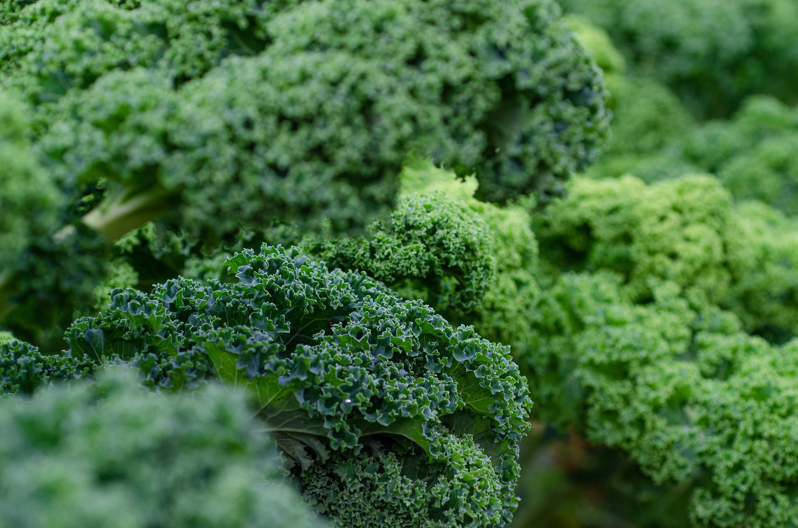
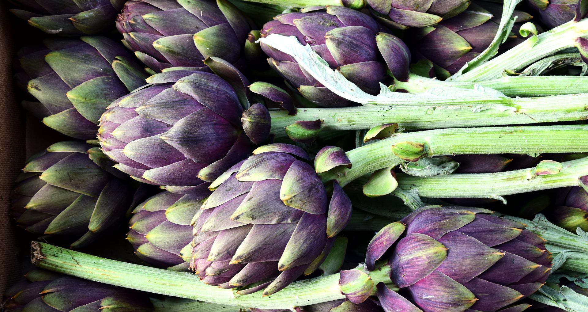
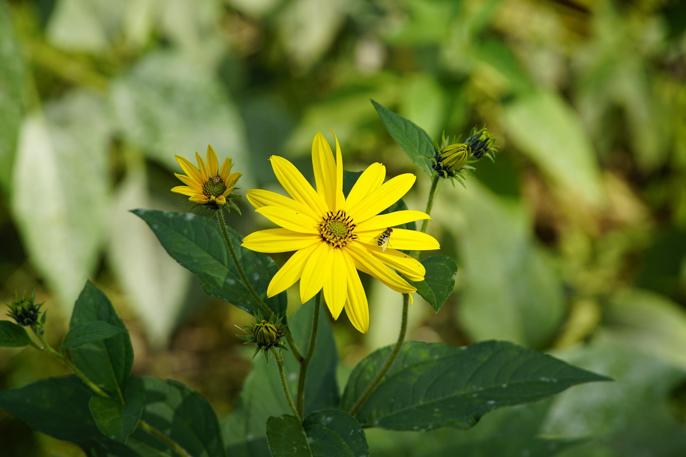
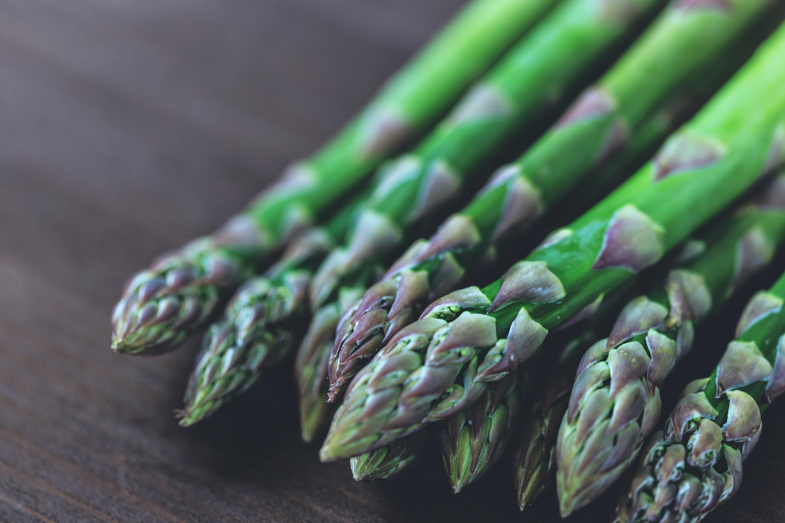
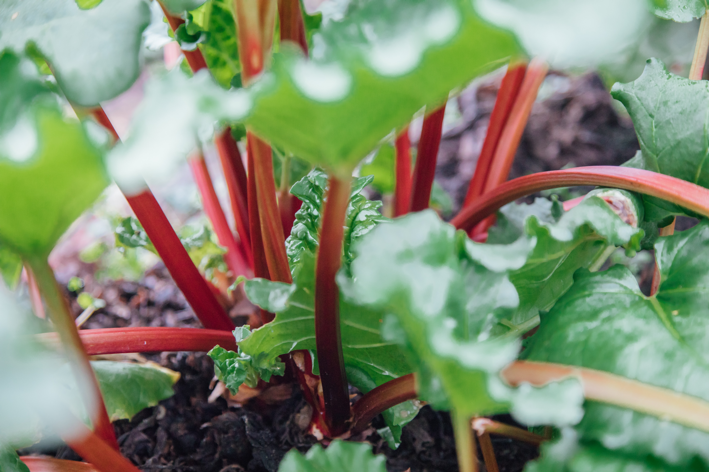
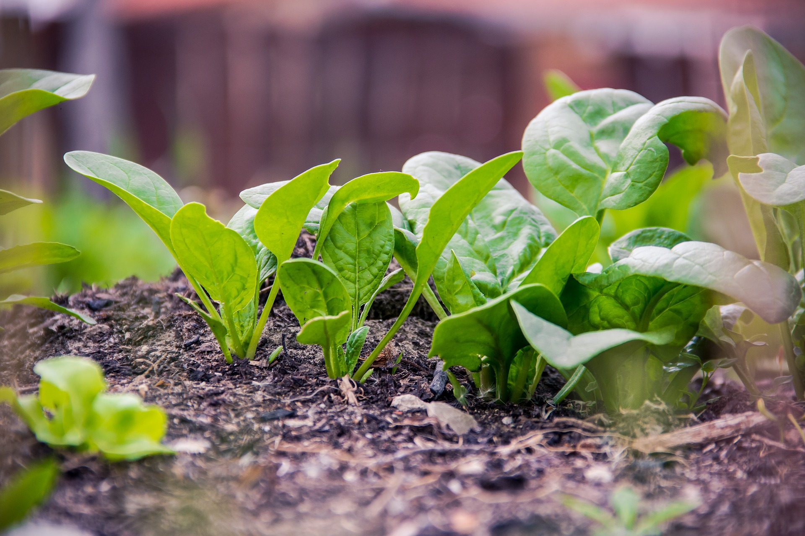
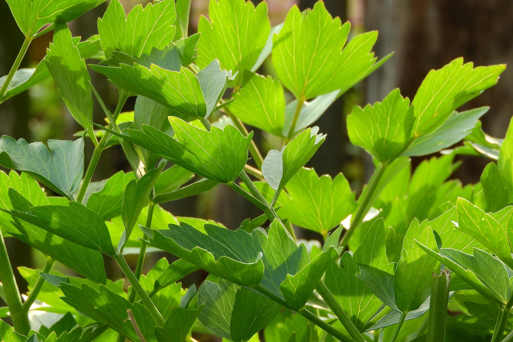

Title: Perennial vegetables to grow
Date: 2022-07-10 20:18
Modified:  2022-07-10 20:18
Category: gardening
Tags: gardening, edibles
Slug: perennial-veg-1
Authors: Will Frank
Summary: Grow veggies that keep on giving.
Image: ./images/perennial-veg/veg-garden.jpg

Growing more perennial vegetables in your veg patch is a sustainable way to 
provide food for the kitchen. Perennials are plants that have a lifespan that is
longer than two years and will continue to give you a crop year after year.

Perennials save both precious time and energy compared to all the
sowing, planting, and raising new plants that is needed every year when growing
annuals.

Perennials can also be help to maintain soil structure as they don't need to be
dug up and the soil is left undisturbed.

Here are some of my favourite perennial vegetables to get started with:

## 1. Brassicas (such as kale and cabbage)

Wild cabbage (the common ancestor of the Brassica family) is a perennial and 
although typically grown as annuals, there are a number of nutritious perennial
brassica cultivars.

## 2. Globe artichokes

Globe artichokes are ornamental perennial plants that make a fantastic addition
to the veg garden or flower border. Grown for their flavoursome flower buds.

## 3. Jerusalem artichokes

Jerusalem artichokes are easy-to-grow plants that produce a large crop of
underground edible root tubers, for harvesting in autumn and winter. The tubers
give a sweet, nutty flavour to soups, stews and salads.

## 4. Asparagus

Asparagus can be expensive to buy and has excellent flavour when picked and
eaten fresh. Asparagus takes two years to mature from planting one-year-old
crowns but can continue to provide a harvest for up to 20 years.

## 5. Rhubarb

Rhubarb is a hardy perennial that is very easy to grow and crops well for many
years. Reknowned for its use in pies and crumbles, rhubarb makes a decorative
addition to any vegetable garden.

## 6. Perpetual spinach

Perpetual spinach is another easy to grow vegetable that, as the name implies,
will keep producing tasty and nutrious leaves all year round.

## 7. Lovage

Lovage has very attractive foliage and is as at home among ornamental plants in
the border as it is in the vegetable garden. It has a flavour similar to celery
and is a worthy addition to salads, soups, and stews.

