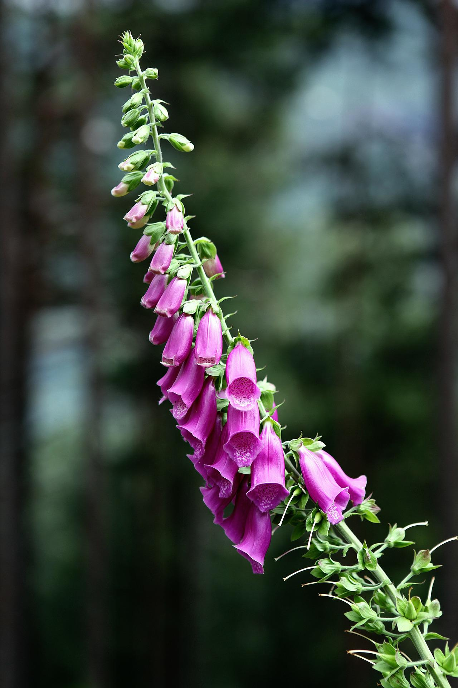
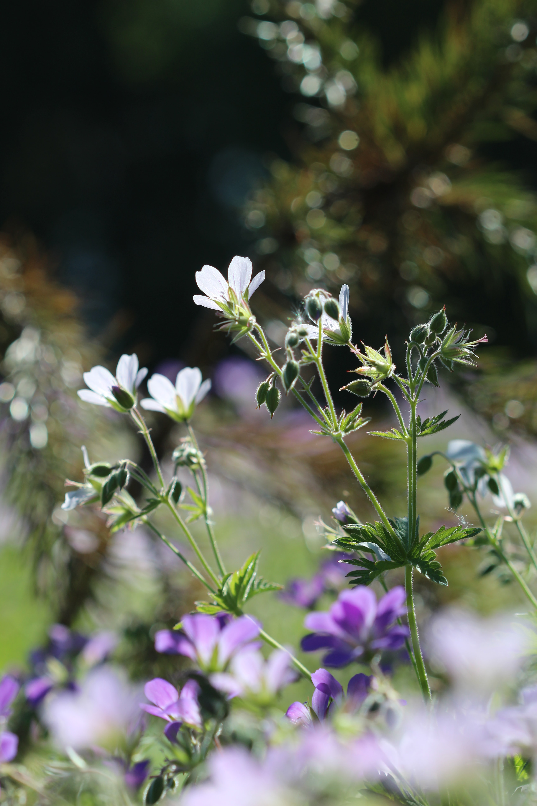
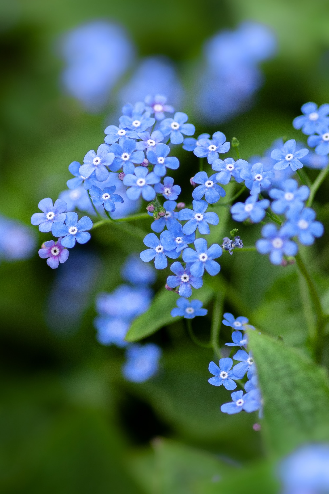
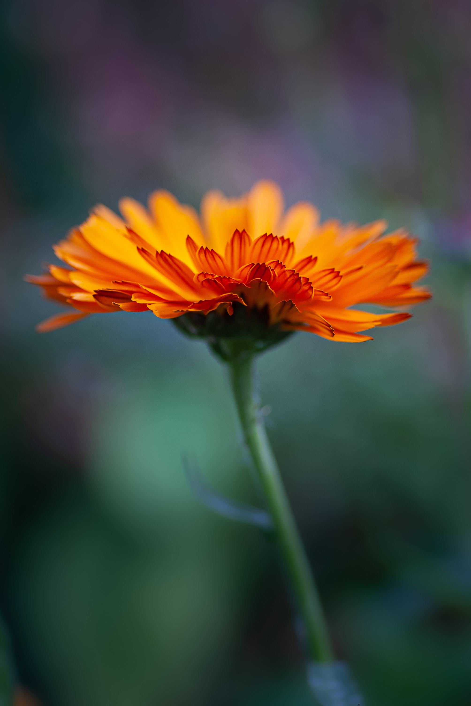
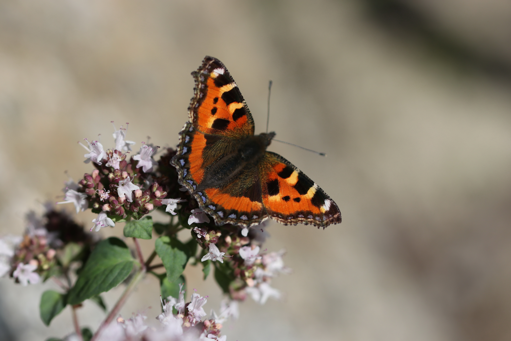
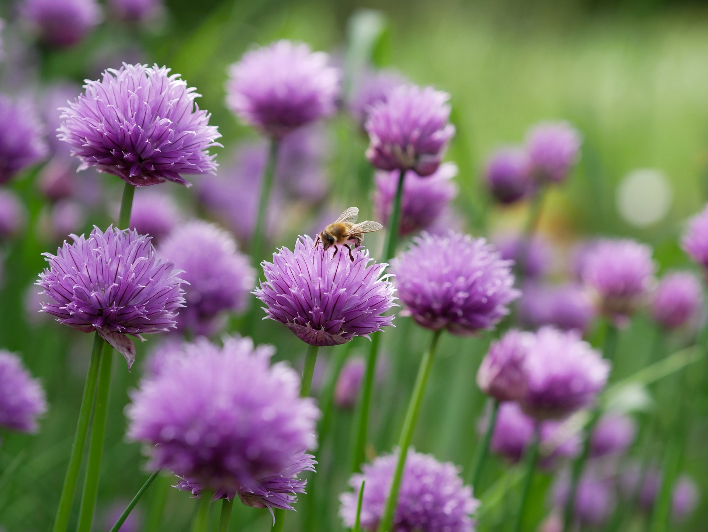
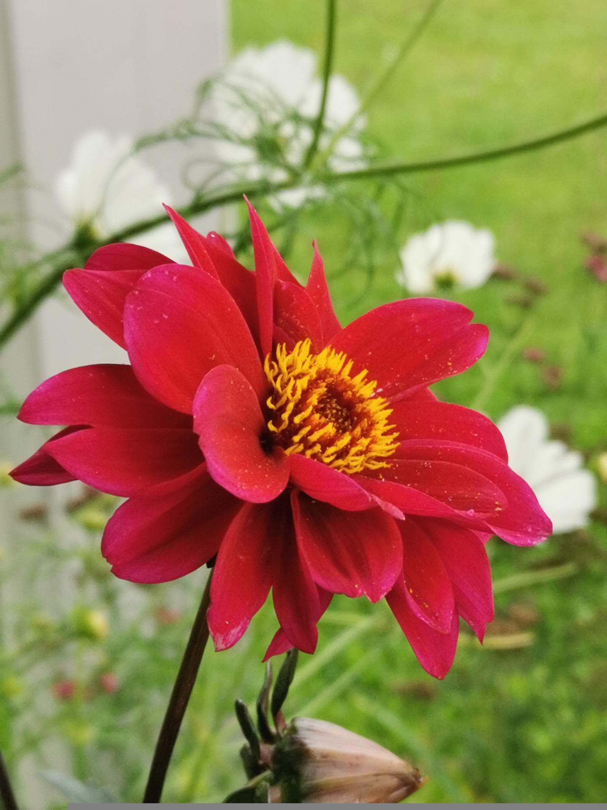
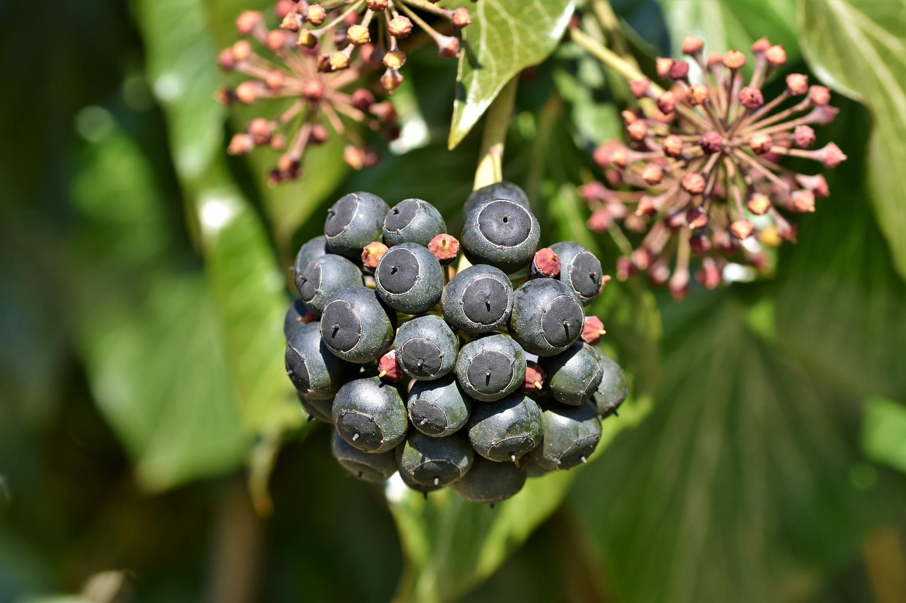
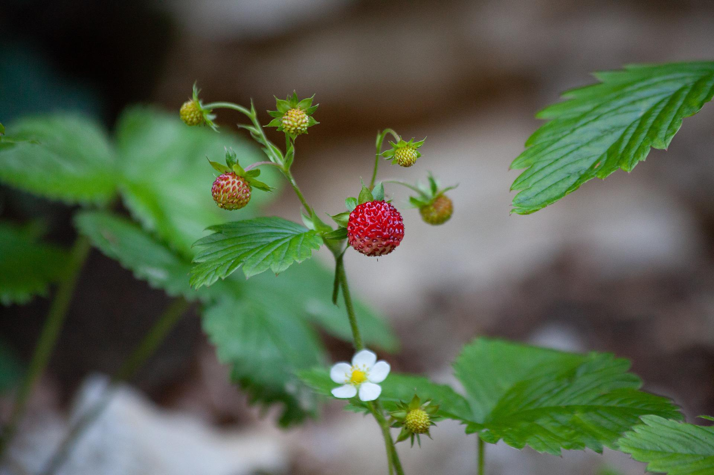

Title: Planting for nature: My top 10 wildlife-friendly plants
Date: 2021-09-05 09:50
Modified: 2021-09-05 09:50
Category: Gardening
Tags: gardening, wildlife, conservation
Slug: wildlife-plants
Authors: Will Frank
Summary: Discover the top 10 plants that will turn your garden into a haven for nature.
Image: ./images/wildlife-plants.jpg

Collectively our gardens are home to a wide range of living creatures and form
an increasingly beneficial habitat for wildlife.

The way we choose to manage our outdoor spaces can make a big difference to the
natural world. By growing more wildlife-friendly plants we can attract a wider
range of species into our gardens, creating a haven for nature.

These plants are some of the best ornamental flowers, wildflowers, and herbs in
my small back garden that wildlife absolutely love.

## 1. Common foxglove *(Digitalis purpurea)*

This cottage garden classic is one of my favourite native flowers. An excellent
source of nectar for both bees and moths.

## 2. Hardy geranium/cranesbill *(Geranium spp.)*

Most hardy Geraniums are great for bees with plenty of easy to grow species to
choose from.

## 3. Forget-me-not *(Myosotis sylvatica)*

This prolific spreader is known for attracting bees, butterflies​ and moths with
its nectar rich flowers. It also provides food for many caterpillars.

## 4. Pot marigold *(Calendula officinalis)*

An excellent companion plant that attracts garden pest predators. Sow liberally
around your vegetable garden to attract lacewings whose larvae will feed on
aphids. 

## 5. Marjoram *(Origanum vulgare)*

A must have in any kitchen garden, this aromatic herb is attractive to a whole
host of pollinators.

## 6. Chive *(Allium schoenoprasum)*

Many _Allium_ species are great for pollinators and chives are no exception.
They are easy to grow and should feature in every herb garden.

## 7. Dahlia (single or semi-double, *Dahlia spp.*)

Commonly underrated for their wildlife friendliness, open Dahlia varieties are
very attractive to bees. One of my absolute favourite garden flowers.

## 8. Ivy *(Hedera helix)*

The plain green flowers of ivy are are a magnet for invertebrates including
butterflies, bees, wasps, and hoverflies. They flower in early-autumn when most
other flowers have finished, providing a much needed food source at this time
of year. The berries then provide food for birds over winter.

## 9. Comfrey *(Symphytum officinale)*

Another kitchen garden essential, bees absolutely love comfrey. It can be made
into a rich liquid plant feed and is an excellent addition to the compost heap.
As a prolific seeder it can be somewhat invasive and carefully siting is
important.

## 10. Wild strawberry *(Fragaria vesca)*

These minature wild plants make a tasty snack for many birds and mammals
(including humans for that matter!)

