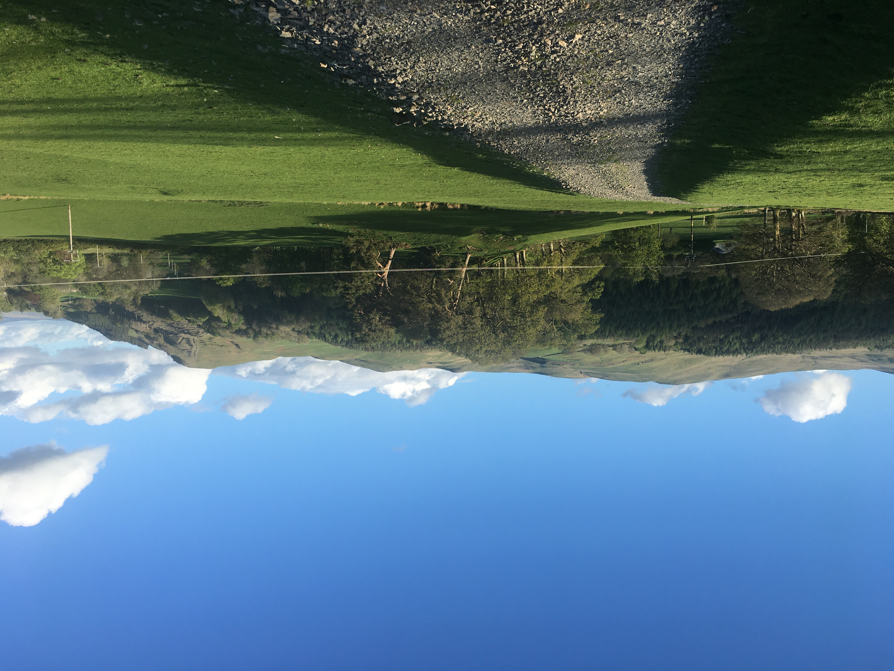

Title: Journal

# Sense of Place

We always discuss 'sense of place' as being a fundamental aspect of what we do, creating somewhere that not only sits comfortably within its surroundings, but also feels right on an emotional level. The journey starts on the narrow winding lane that leads to the property. Currently the bracken is a distinctive rusty brown, on its last legs before it fades back into the ground, trees sit bare revealing the lichen on their branches and the last of the rose hips sit entangled within the hedgerow. It’s a windblown hill top, one that has crooked Hawthorns that sit throughout the common land. The brook that passes through the garden is aptly named Sgithwen, meaning Hawthorn. It's a tree that feels at home here and one that will become an important addition within the garden.

_This is a photograph._